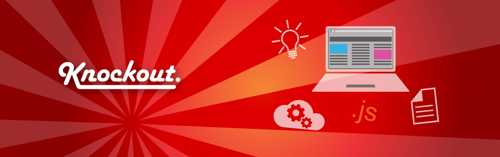
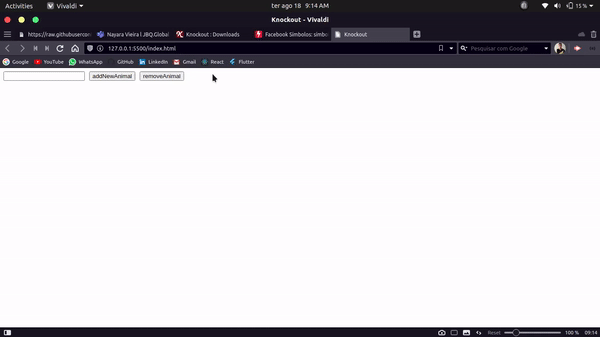

<h1 align="center">
  
</h1>

<p align="center">
  <a href="#-knockout">O que é Knockout?</a>&nbsp;&nbsp;&nbsp;|&nbsp;&nbsp;&nbsp;
  <a href="#-como-usar">Como usar</a>&nbsp;&nbsp;&nbsp;|&nbsp;&nbsp;&nbsp;
  <a href="#-exemplo-simples">Exemplo simples</a>&nbsp;&nbsp;&nbsp;|&nbsp;&nbsp;&nbsp;
  <a href="#-bindings">Bindings</a>&nbsp;&nbsp;&nbsp;|&nbsp;&nbsp;&nbsp;
  <a href="#-como-ajudar">Como ajudar</a>&nbsp;&nbsp;&nbsp;|&nbsp;&nbsp;&nbsp;
</p>

<hr />
<br />

## 🌞 O que é Knockout?

<b>Knockout</b> é uma biblioteca JavaScript que ajuda você a criar interfaces de usuário, com Vanilla JS, e telas ricas e responsivas com um modelo de dados subjacente limpo. Ele ultiliza bindings de vários tipos que representam ações que o usuário pode realizar para se comunicar com o documentos HTML. Sempre que você tiver seções da IU que são atualizadas dinamicamente (por exemplo, mudando dependendo das ações do usuário ou quando uma fonte de dados externa muda), o <b>KO</b> pode ajudá-lo a implementá-lo de forma mais simples e sustentável.

### 🎯 Vantagens

<b>Rastreamento de dependência elegante:</b> atualiza automaticamente as partes certas de sua IU sempre que seu modelo de dados muda.

<b>Bindings declarativos:</b> uma maneira simples e óbvia de conectar partes de sua IU ao seu modelo de dados. Você pode construir interfaces de usuário dinâmicas complexas facilmente usando contextos de vinculação aninhados arbitrariamente.

<b>Facilmente extensível:</b> implemente comportamentos personalizados como novos vínculos declarativos para fácil reutilização em apenas algumas linhas de código.

<br />

## 💻 Como usar

Primeiro você deve baixar o [arquivo knockout](https://knockoutjs.com/downloads/index.html) no seu projeto e importar esse script no seu documento.

Com KO fica tudo mais fácil. Ele permite aumentar a complexidade sem medo de introduzir inconsistências. Apenas represente seus itens como uma matriz JavaScript e, em seguida, use uma ligação foreach para transformar essa matriz em uma TABELA ou conjunto de DIVs. Sempre que a matriz muda, a IU muda para corresponder (você não precisa descobrir como injetar novos TRs ou onde injetá-los). O resto da IU permanece sincronizado.

### Por exemplo, você pode vincular declarativamente um SPAN para exibir o número de itens da seguinte maneira:

<br />

```html
There are <span data-bind="text: myItems().length"></span> items
```

onde `text` é o binding que diz para o documento o que o KO irá fazer, e `myItems().length` o valor que será aplicado nessa tag `span`!

<br />

### Você não precisa escrever código para atualizá-lo, ele é atualizado por conta própria quando o array `myItems` muda. Da mesma forma, para ativar ou desativar o botão ‘Adicionar’ dependendo do número de itens, basta escrever:

<br />

```html
<button data-bind="enable: myItems().length < 5">Add</button>
```

<br />

## 🧠 Exemplo simples

Vamos supor que queremos contruir uma lista de qualquer no nosso projeto, por exemplo, uma lista de animais, vamos precisar de um input para conseguir capturar o nome do animal informado pelo usuário, um botão para salvar na lista e outro para remover da lista. Isso pode ser feito intuitivamente com KO.

<h1 align="center">
    
</h1>

```html
<!DOCTYPE html>
<html lang="en">
  <head>
    <meta charset="UTF-8" />
    <meta name="viewport" content="width=device-width, initial-scale=1.0" />
    <title>Exemplo simples</title>
  </head>
  <body>
    <div>
      <input type="text" data-bind="value: animal" />
      <button type="submit" data-bind="click: addNewAnimal">
        addNewAnimal
      </button>
      <button type="submit" data-bind="click: removeAnimal">
        removeAnimal
      </button>

      <ul data-bind="foreach: array">
        <li data-bind="text: $data"></li>
      </ul>
    </div>

    <script src="knockout-3.5.1.js"></script>
    <script>
      var vm = {
        animal: ko.observable(),
        array: ko.observableArray(),
        addNewAnimal: function () {
          if (this.animal()) this.array.push(this.animal());
        },
        removeAnimal: function () {
          this.array.pop();
        },
      };

      vm.animal("");
      ko.applyBindings(vm);
    </script>
  </body>
</html>
```

Repare que as tags HTML funcionam normalmente, porém agora elas possuem a propriedade `data-bind` que serve para referenciar a qual binding essa tag está associada.

<br />

### Vamos analisar cada parte do código:

Primero temos o nosso View Model, nele está contido as variáveis que o nosso documento pode usar.

```js
var vm = {
  animal: ko.observable(),
  array: ko.observableArray(),
  addNewAnimal: function () {
    if (this.animal()) this.array.push(this.animal());
  },
  removeAnimal: function () {
    this.array.pop();
  },
};

vm.animal("");
ko.applyBindings(vm);
```

- <b>`animal`</b>: uma variável do tipo `observable`, que basicamente é algo que fica observando alterações no valor dela para que a tag que estiver usando-a seja atualizada se nessesário.

- <b>`array`</b>: que guarda os animais salvos, ele também é de um tipo observable, so que agora um observableArray, possue a mesma funcionalidade, porém guarda vários dados.

- <b>`addNewAnimal` e `removeAnimal`</b>: adiciona e remove elementos do array de animais.

No fim desse trecho vemos `ko.applyBindings(vm);` que basicamente deixa as variáveis ultizaveis para o nosso documento.

<br />

Agora na nossa `div` de ação podemos usar as variáveis supracitadas como bindings.

```html
<div>
  <input type="text" data-bind="value: animal" />
  <button type="submit" data-bind="click: addNewAnimal">
    addNewAnimal
  </button>
  <button type="submit" data-bind="click: removeAnimal">
    removeAnimal
  </button>

  <ul data-bind="foreach: array">
    <li data-bind="text: $data"></li>
  </ul>
</div>
```

Na propriedade `data-bind` temos dois valores. O primeiro é o tipo de binding que a tag deve usar, exemplo:

```html
<input type="text" data-bind="value: animal" />
```

A tag `input` deve receber um valor digitado, logo ela recebe o binding de tipo `value`, e em qual variável esse valor deve ser armazenado? Em `animal`, simples assim!

```html
<button type="submit" data-bind="click: addNewAnimal">
  addNewAnimal
</button>
```

Já o `button` functiona de uma forma diferente, logo ele recebe a chave `click`, que como o nome já mostra, algo será feito após o click do usuário. A função `addNewAnimal` será executada!

```html
<ul data-bind="foreach: array">
  <li data-bind="text: $data"></li>
</ul>
```

Na `ul` temos algo um pouco diferente, como a variável `array` é um array podemos setar o binding `foreach` nela, assim tudo que estiver dentro a ul será repetido em relação a quantidade de elementos que o array possui! E partindo disso a `li` pode usar esse elemento e mostrar em tela com o binding `text`!

### Basicamente esse é o funcionamento do KnockoutJS é algo para auxiliar o dev de JS Puro.

<br />

## ⛓ Bindings (🚧 em construção)

```js
////////////////////////////////////
```

<br />

## 🤔 Como ajudar

- Faça um fork;
- Crie uma branch para acresentar a documentação: `git checkout -b my-doc`;
- Faça um commit: `git commit -m 'doc: My new doc'`;
- Faça um push para o repo de orirem: `git push origin my-doc`.

<br />

<p align="center">
  Made with ❤️ by <a href="https://www.linkedin.com/in/ronnyacacio/"> Ronny Acácio </a>
</p>
